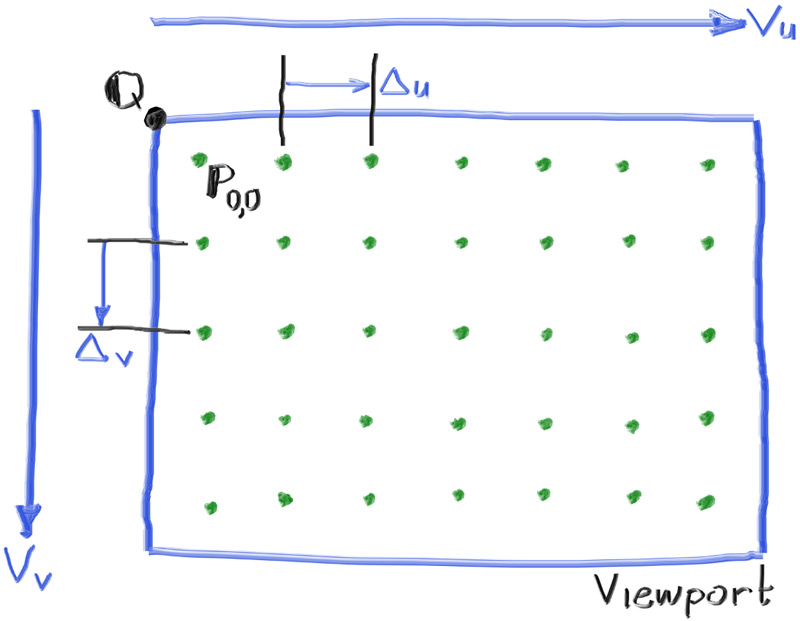

# Chapter 4

## What is a Ray Tracer:
- At its core, a ray tracer sends rays through pixels and computes the color seen in the direction of those rays
- The involved steps are:
	1. Calculate the ray from the camera(eye) through the pixel,
	2. Determine which objects the ray intersects, and
	3. Compute a color for the closest intersection point.

### Function: P(t)=A+*t*b
- **P** is a 3D position along a line in 3D.
- **A** is the ray origin
- **b** is the ray direction
- The ray parameter *t* is a real number (double in the code).
- Plug in a different *t* and P(t) moves the point along the ray.
- For positive *t*, you get only the parts in front of **A**, 
- for negative *t*, you get the parts in behind **A**

#### `const vec::point3&` (before the function name):
- This is the return type.
- It means the function returns a reference to a `point3` that cannot be modified through this reference.
- You can read the vector, but you cannot change its components.

#### `const` after the function name (at the end):
- This is a member function qualifier.
- It means the function does not modify the object it belongs to (`this` is treated as `const`).

#### Aspect Ratio:
- Choosing to go with 16:9 due to the author transposing 'x' and 'y'
- width/height = Aspect Ratio
- allows me to derive height
- Viewport height = 2.0

#### Viewport Width:
- Note that we don't use `aspect_ratio` when computing `viewport_width`
- Since `image_height` is an int, 16.0/9.0 may not be the true aspect ratio between `image_height`, and `image_width`
    - `image_height` may truncate since it's an int
- After truncating `image_height`, the denominator becomes slightly smaller, so the actual ratio `image_width` / `image_height` becomes slightly larger than 16/9.
    - If you want a rough upper bound, you can think of it like 16 / x where x ≤ 9.

#### Focal Length:
- The vector from the camera center to the viewport center will be orthogonal (perpendicular) to the viewport. 
- Initially, the distance between the viewport and the camera center point will be one unit. 
- This distance is referred to as the focal length.

##### Camera Geometry:
- y-axis points up, 
- x-axis points right
- negative z-axis points in the viewing direction
- 

#### Image Geometry:
- Images usually use top-left as (0,0)
- x increases to the right, but y increases going down.
    - This is just a historical convention in computer graphics and image formats:
	- Most image formats (BMP, PNG, PPM, etc.) consider the top-left corner as (0,0).

#### V~u~ and V~v~
- To help navigate the pixel grid, 
    - we'll use a vector from the left edge to the right edge (V~u~),
	- a vector from the upper edge to the lower edge (V~u~).

#### Pixel 0,0
- 
- P(0,0) represents the center of the top-left pixel
- `viewport_upper_left` is Q from Figure 4 
- pixel_delta_u and pixel_delta_v are the distance from one pixel to another.
    - Since P(0,0) is only half the distance of `pixel_delta_u` horizontally, and half the distance of `pixel_delta_v`, from Q. So only half of their sum is added to `viewport_upper_left` (aka Q):
	- `viewport_upper_left + 0.5 * (pixel_delta_u + pixel_delta_v)`
	- **Note**: `pixel_delta_v` is negative because Y increases downward in image coordinates

#### Rendering in for loop:
