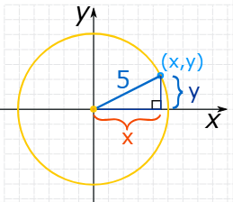
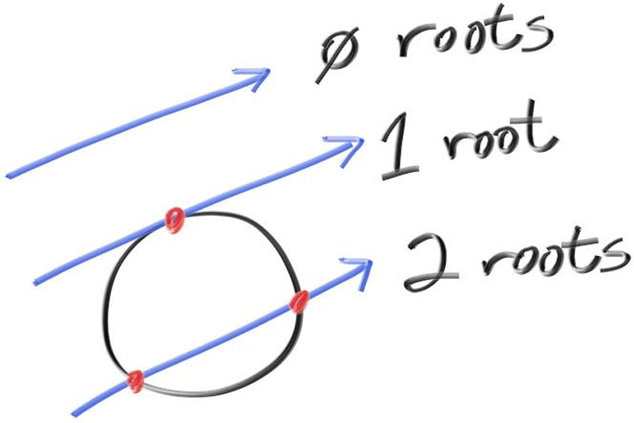

# Chapter 5: Adding a Sphere

### Equation of a circle:
- We make a right-angled triangle:

- And then use Pythagoras:
$$x^2 + y^2 = r^2$$

### Equation of a Sphere:
- Similarly, the **equation of a Sphere centered at the origin** is:
$$x^2 + y^2 + z^2 = r^2$$

- The **distance from the origin (0,0,0) to a point (x,y,z)** is:
$$\sqrt{x^2 + y^2 + z^2} = r$$

- A **point inside the sphere** would be less than r units away from the origin:
$$\sqrt{x^2 + y^2 + z^2} < r$$

- A **point outside the sphere** would be more than r units away from the origin:
$$\sqrt{x^2 + y^2 + z^2} > r$$

### A sphere centered at $(C_x, C_y, C_z)$:
- A sphere's center may not be at the origin (0,0,0), but instead at center = $(C_x, C_y, C_z)$
- So a point (x,y,z) on the surface of the sphere would be:
$$(C_x-x)^2 + (C_y-y)^2 + (C_z-z)^2 = r^2$$

- Therefore, a vector from point $P=(x,y,z)$ to the center $C=(C_x, C_y, C_z)$ is $(P-C)$

- Then we can write $r^2$ as a dot product:

$$(C−P)⋅(C−P)=(C_x-x)^2 + (C_y-y)^2 + (C_z-z)^2 = r^2$$
    
   - **Any point that satisfies this equation is on the surface of the sphere**

### $P(t)=Q+td$
- In Chapter 4, I read about the Ray class and how rays can be represented as the function:
    - $P(t)=A+tb$
    - P is a 3D position along a line in 3D.
    - A is the ray origin
    - b is the ray direction
- Using that equation, I want to know if a ray $P(t)=Q+td$ ever hits the sphere anywhere
    - If it does, then there is some $t$ that satisfies this equation:
        - $$(C−P(t))⋅(C−P(t))=r^2$$
        - $$(C−(Q+td))⋅(C−(Q+td))=r^2$$

#### Expanding $(C−(Q+td))⋅(C−(Q+td))=r^2$
$$(C−(Q+td))⋅(C−(Q+td))=r^2$$

Reordering the terms (t is a scalar):

$$(-td+(C-Q))⋅(-td+(C-Q))=r^2$$

$$(-td)⋅(-td+(C-Q))+(C-Q)⋅(-td+(C-Q))=r^2$$

$$t^2(d⋅d) + (-t)d⋅(C-Q) + (C-Q)⋅(-t)d + (C-Q)⋅(C-Q) = r^2$$

$$t^2(d⋅d)-2t(d⋅(C-Q))+(C-Q)⋅(C-Q)=r^2$$

**For this to be a quadratic equation we need to move the $r^2$ to the left**

$$t^2(d⋅d)-2t(d⋅(C-Q))+(C-Q)⋅(C-Q)-r^2=0$$

**We essentially get a quadratic equation, $t$ is the only unknown**

$$at^2+bt+c=0$$

Where:
$$a=d⋅d$$ so, $$ax^2=t^2(d⋅d)$$

$$b=-2d⋅(C-Q))$$

$$c=(C-Q)⋅(C-Q)-r^2$$

##### Quadratic Formula
$$ x = {-b \pm \sqrt{b^2-4ac} \over 2a} $$

- $$b^2-4ac > 0$$ (2 solutions)
- $$b^2-4ac = 0$$ (1 solution)
- $$b^2-4ac < 0$$ (0 solutions)
- 

##### hit_sphere
- we are testing to see if a ray intersects with the sphere by solving the quadratic equation and seeing if a solution exists


### Why is the Sphere red?
Look at your ray_color function:
```cpp
if (hit_sphere(vec::point3(0, 0, -1), 0.5, r))
    return color(1, 0, 0);
```

- This overrides everything else.

- If the ray intersects the sphere, you immediately return red, without computing the gradient result.

- Only rays that miss the sphere reach the unit_direction part and compute the background gradient.

- So the red color is hard-coded for any pixel that intersects the sphere.
- `ray_direction` comes from the center of the camera lens, to the pixel's center. Each pixel has a ray.
